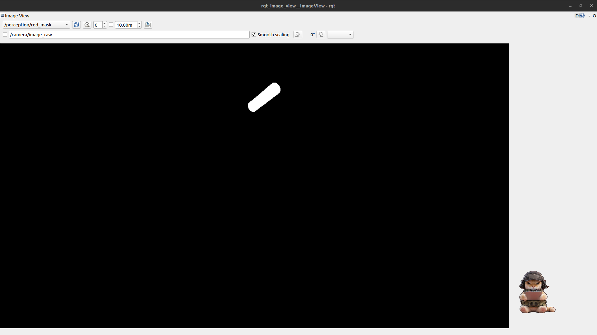
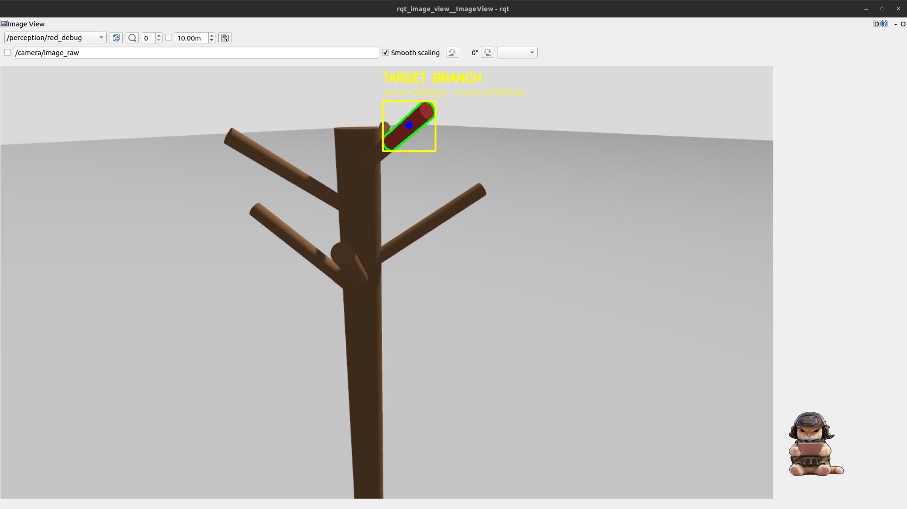
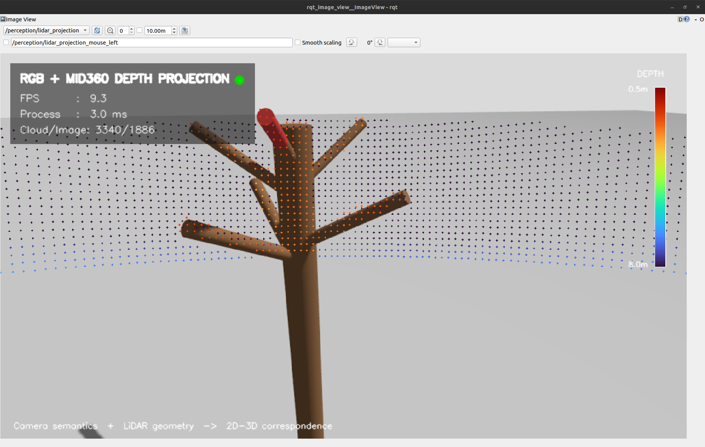
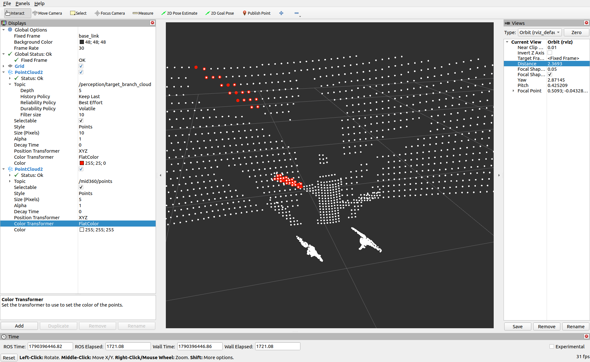
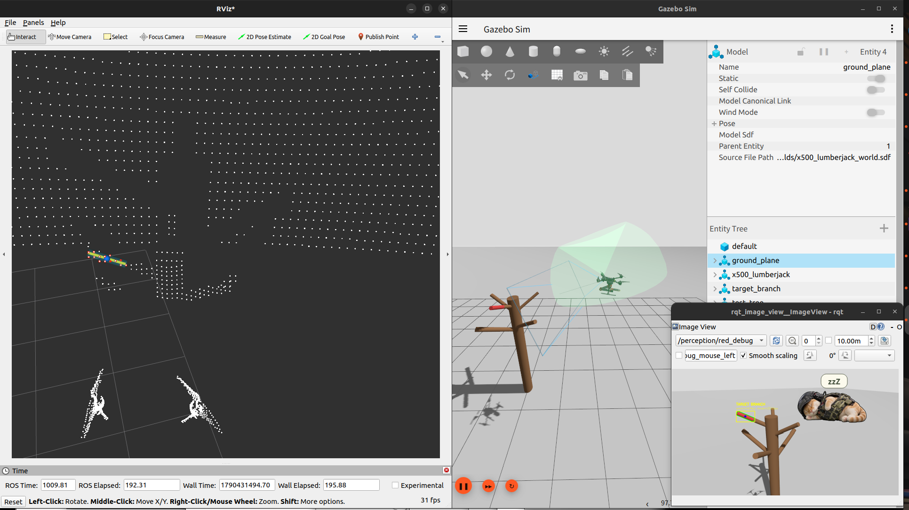

# Step13（阶段 C）小结：基于 RGB–LiDAR 融合的目标枝条三维感知与几何参数提取

## 1. 小结

**本阶段目标：**
> **把“相机里看到的一根目标枝条”，转换成 UAV 后续定位、接近和切割能够直接使用的三维几何模型。**

当前采用 RGB-LiDAR 融合：

- RGB：负责判断“哪里是目标枝条”；
- LiDAR：负责提供对应位置的三维点；
- 点云处理：用于把 UAV 不同位置看到的同一根枝条叠加起来；
- 几何建模：进一步估计枝条的中心、方向、长度和半径。

整体流程为：

```text
单目相机采集
  ↓
RGB 图像处理
  ↓
目标 Mask
  ↓
LiDAR 点变换到 Camera 坐标系并投影到图像
  ↓
利用 Mask 筛选目标 LiDAR 点
  ↓
背景穿透 → 深度聚类
  ↓
目标检测状态机
  ↓
转换到 world 坐标系
  │
  ├─> 单帧 PCA / 圆柱几何拟合
  │
  └─> 多视角关键帧融合
          ↓
      多视角 PCA / 圆柱几何拟合
```

### 当前实验结果

-  **单视角已经能够较稳定地估计枝条主方向和长度，但半径容易因为只看到局部圆柱表面而明显低估。**
- **引入多视角 world 点云融合后，半径误差由单视角常见的约 30%～50%，降低到两组三视角实验中的 1.70% 和约 7.2%。**

---

## 2. 最终目标：枝条几何模型

**先明确输出目标：最后不是只想得到一堆点，而是要把这些点变成后续规划真正能用的几何参数。**

将目标枝条定义为：

\[
\boxed{
\mathcal B=
\left\{
\mathbf p_0,\mathbf d,L,r
\right\}
}
\]

其中：

- \(\mathbf p_0\)：枝条几何中心；
- \(\mathbf d\)：枝条主轴方向单位向量；
- \(L\)：枝条有效长度；
- \(r\)：枝条半径。

Step13 最终希望完成的是：

```text
目标枝条点云
      ↓
{ p0, d, L, r }
      ↓
为后续切割规划奠定基础
```

### 2.1 操纵指令

终端 1：启动 Step13 仿真

```bash
cd ~/UAV_lumberjack/ros2_ws
source /opt/ros/humble/setup.bash
source install/setup.bash
ros2 launch uav_lumberjack_control uav_arm_step13.launch.py
```

终端 2：启动 Step13 感知

```bash
cd ~/UAV_lumberjack/ros2_ws
source /opt/ros/humble/setup.bash
source install/setup.bash
ros2 launch uav_lumberjack_perception step13_perception.launch.py
```

终端 3：启动 RViz

```bash
cd ~/UAV_lumberjack/ros2_ws
source /opt/ros/humble/setup.bash
source install/setup.bash
rviz2 --ros-args -p use_sim_time:=true
```
终端 4/5：查看图像输出
```bash
ros2 run rqt_image_view rqt_image_view 
```

清空旧融合数据：

```bash
ros2 service call /perception/multiview/reset std_srvs/srv/Trigger "{}"
```

在不同 UAV 观察位置执行：

```bash
ros2 service call /perception/multiview/capture std_srvs/srv/Trigger "{}"
```

---

## 3. 传感器与 TF 基础验证

**确认相机、LiDAR 以及它们之间的位置关系**

### 3.1 单目相机

当前相机主要参数（基于真实设备设置）：

- 分辨率：1280 × 720；
- 帧率：约 30 Hz；
- 水平视场角：约 90°；
- 图像话题：`/camera/image_raw`；
- CameraInfo：`/camera/camera_info`。

TF 链：

```text
base_link
  ↓
camera_link
  ↓
x500_lumberjack/camera_link/imager
```

### 3.2 激光雷达

主要参数（根据 MID-360 配置）：

- 水平视场：360°；
- 垂直视场：约 \(-7^\circ\sim+52^\circ\)；
- 分辨率：360 × 60；
- 更新频率：约 10 Hz；
- 点云话题：`/mid360/points`。

TF 链：

```text
base_link
  ↓
mid360_mount_link
  ↓
mid360_link
  ↓
x500_lumberjack/mid360_link/mid360_gpu_lidar
```

---

## 4. 在图像中定位目标（Mask）

**在二维图像里告诉系统“哪些像素属于我要找的枝条”。**

当前仿真阶段暂不直接使用 YOLO，而是利用目标枝条的红色外观做简化语义识别。
> （“语义”可以直接理解为：判断“这是不是我要找的目标”。）

Mask 是一个二值图：
- 目标像素：255；
- 非目标像素：0。

因此：

\[
M(u_i,v_i)>0
\]

就表示像素 \((u_i,v_i)\) 落在目标区域。

<p align="center">
  
</p>

### 4.1 Mask 鲁棒性改进

初版颜色条件较宽，在部分角度和光照下会把棕色树体误识别成目标。

最终采用：

\[
H\in[0,8]\cup[172,179]
\]

\[
S\ge110,
\qquad
V\ge30
\]

同时：

- `min_area = 80 px`；
- 只保留最大的有效连通区域。

主要输出：

```text
/perception/red_mask_raw    # 原始候选
/perception/red_mask        # 最终目标 Mask
/perception/red_debug       # 调试图
```

改进后在多个角度和不同光照下，目标识别明显更加稳定。

<p align="center">
  
</p>

---

## 5. 二维目标图像转换三维目标点云

**相机已经告诉“哪一块是目标”，现在要知道这块目标在三维空间中到底在哪里。**

### 5.1 LiDAR → Camera 坐标转换

首先把 LiDAR 点从 LiDAR 坐标系转换到 Camera 坐标系。

设：

- \(\mathbf p_L\)：LiDAR 坐标系中的三维点；
- \(\mathbf p_C\)：同一点在 Camera 坐标系中的坐标；
- \(R_{CL}\)：LiDAR 坐标系到 Camera 坐标系的旋转矩阵；
- \(t_{CL}\)：LiDAR 坐标系到 Camera 坐标系的平移向量。

则最核心的外参变换就是：

\[
\boxed{
\mathbf p_C
=
R_{CL}\mathbf p_L+t_{CL}
}
\]

这一步可以直观理解成：

> **先把 LiDAR 测到的点“搬到相机坐标系里”。**

### 5.2 Camera 三维点 → 图像像素

当前 Gazebo 相机坐标约定为：
- \(+X\)：前方；
- \(+Y\)：左；
- \(+Z\)：上。

若：

\[
\mathbf p_C
=
[X_C,Y_C,Z_C]^T
\]

则投影到图像：

\[
\boxed{
u
=
c_x-f_x\frac{Y_C}{X_C}
}
\]

\[
\boxed{
v
=
c_y-f_y\frac{Z_C}{X_C}
}
\]

于是建立：

\[
\boxed{
(u_i,v_i)
\leftrightarrow
\mathbf p_i^{3D}
}
\]

也就是说：

> 一个二维像素，现在可以找到它对应的 LiDAR 三维点；
> 反过来，一个 LiDAR 点也知道自己应该落在图像哪里。

<p align="center">
  
</p>

### 5.3 利用 Mask 筛选目标三维点

对每个 LiDAR 点完成投影后，检查：

\[
M(u_i,v_i)>0
\]

如果成立：

\[
\mathbf p_i^{3D}
\]

就被保留。

整个逻辑可以很直观地理解为：

```text
LiDAR 3D 点
   ↓
转换到 Camera 坐标系
   ↓
投影到图像像素 (u,v)
   ↓
这个像素在目标 Mask 里面吗？
   ├─ 是 → 保留对应 3D 点
   └─ 否 → 删除
```

这样就完成了从：

```text
二维目标区域
```

到：

```text
三维目标候选点云
```

<p align="center">
  
</p>

### 5.4 深度聚类：去掉远处背景点

只靠 Mask 还不够。**Mask 只判断二维像素是否属于目标区域，并不能区分同一视线方向上不同深度的三维点**；
因此目标枝条后方的树干或其他背景点，也可能投影到同一白色 Mask 区域，形成“背景穿透”。

> 对候选点的深度做一维聚类。

当前主要约束：

- 相邻深度聚类间隔：0.20 m；
- 最小聚类点数：5；
- 有效目标深度范围：0.20～5.0 m；
- 单聚类最大深度跨度：0.60 m；
- 最大时序深度跳变：0.60 m；
- 最大质心跳变：0.75 m。

> 无需要写死枝条距离，亦能排除大部分远背景点。

### 5.5 目标有效性状态机

UAV 移动时由于俯仰角或横滚角，目标可能短暂离开视野或出现漏检。

为了避免一帧异常就把背景误认为新目标，加入：

```text
TRACKING
LOST
REACQUIRING
```

逻辑为：

```text
TRACKING
  ↓ 连续 3 帧缺失
LOST
  ↓ 再次出现候选
REACQUIRING
  ↓ 连续 3 帧确认一致
TRACKING
```

LiDAR 约 10 Hz，因此 3 帧约对应 0.3 s。

在 1～2 帧短暂缺失期间，不继续输出旧目标，而是输出空点云，避免下游继续使用已经过期的数据。

最终得到：

```text
/perception/target_branch_cloud
frame_id = base_link
```

---

## 6. 从点云提取枝条几何参数

**不再只看“点”，而是从这些点里面算出枝条的方向、中心、长度和粗细。**

<p align="center">
  
</p>

### 6.1 PCA（Principal Component Analysis，主成分分析）提取主方向

对目标点：

\[
\mathbf p_i=[x_i,y_i,z_i]^T
\]

\[
i=1,\ldots,N
\]

先计算点云均值：

\[
\bar{\mathbf p}
=
\frac{1}{N}
\sum_{i=1}^{N}
\mathbf p_i
\]

构造协方差矩阵：

\[
\mathbf C
=
\frac{1}{N}
\sum_{i=1}^{N}
(\mathbf p_i-\bar{\mathbf p})
(\mathbf p_i-\bar{\mathbf p})^T
\]

其中：

\[
\mathbf C=
\begin{bmatrix}
C_{xx} & C_{xy} & C_{xz}\\
C_{yx} & C_{yy} & C_{yz}\\
C_{zx} & C_{zy} & C_{zz}
\end{bmatrix}
\]

特征分解：

\[
\lambda_1\ge\lambda_2\ge\lambda_3
\]

取最大特征值对应的特征向量：

\[
\boxed{
\mathbf d=\mathbf v_1
}
\]

作为枝条第一主方向。

直观理解就是：

> **PCA 把“一堆三维点”变成“一根最能代表这堆点延伸方向的轴”。**

### 6.2 计算中心 \(\mathbf p_0\) 和长度 \(L\)

把所有点沿主方向投影：

\[
s_i
=
(\mathbf p_i-\bar{\mathbf p})^T
\mathbf d
\]

取：

\[
s_{\min}=\min(s_i),
\qquad
s_{\max}=\max(s_i)
\]

则：

\[
\boxed{
L=s_{\max}-s_{\min}
}
\]

枝条几何中心：

\[
\boxed{
\mathbf p_0
=
\bar{\mathbf p}
+
\frac{s_{\min}+s_{\max}}{2}
\mathbf d
}
\]

因此这里的逻辑是：

```text
PCA 得到方向 d
      ↓
所有点沿 d 投影
      ↓
最小投影值 + 最大投影值
      ↓
得到长度 L 和中心 p0
```

仿真长度真值：

\[
L_{GT}=0.300\text{ m}
\]

单视角长度通常约为 0.28～0.31 m，多数情况下误差约 3%～6%。

### 6.3 横截面圆拟合得到半径 \(r\)

长度沿着主轴算，半径则要在主轴的垂直平面上计算。

在垂直于 \(\mathbf d\) 的平面中构造：

\[
\mathbf e_1,\mathbf e_2
\perp
\mathbf d
\]

将三维点投影到横截面：

\[
x_i
=
(\mathbf p_i-\mathbf p_0)^T
\mathbf e_1
\]

\[
y_i
=
(\mathbf p_i-\mathbf p_0)^T
\mathbf e_2
\]

拟合圆：

\[
x^2+y^2+Ax+By+C=0
\]

得到：

\[
c_x=-\frac{A}{2},
\qquad
c_y=-\frac{B}{2}
\]

\[
\boxed{
r=
\sqrt{
c_x^2+c_y^2-C
}
}
\]

仿真半径真值：

\[
r_{GT}=0.038\text{ m}
\]

单视角代表性结果：

| 指标 | 典型结果 | 误差 |
|:---:|:---:|:---:|
| \(L\) | 0.289～0.316 m | 2.6%～5.2% |
| \(r\) | 0.019～0.026 m | 31%～50% |

这里暴露出了当前单视角方法最明显的问题：

> **长度较为准确，但半径误差大。**

**原因分析：**
- 单个 LiDAR 视角只能看到圆柱朝向传感器的局部表面，横截面实际上只是部分圆弧，所以圆拟合容易低估真实半径。

**下一步：**
- 引入多视角融合的直接原因。

<!-- 图片建议：这里插入单帧 PCA 主轴 / 中心 / 长度 / 圆柱拟合 RViz 图，例如 images/single_view_geometry.png -->

---

## 7. world 坐标统一

**UAV 会移动，但树枝不动。故不同位置看到的点必须先转换到同一个固定坐标系，才能正确融合。**

增加：

```text
world
  ↓
base_link
  ├─> camera
  └─> mid360
```

动态 TF 后，将目标点从 `base_link` 转到 `world`：

\[
\boxed{
\mathbf p_W
=
R_{WB}\mathbf p_B+t_{WB}
}
\]

得到：

```text
/perception/target_branch_cloud_world
frame_id = world
```

测试中 UAV 改变位置和姿态后，静止枝条仍基本固定在 world 中，因此不同视角的点云已经具备叠加条件。

### 仿真时间与 RViz

Gazebo、ROS2 和 RViz 最终统一使用 `/clock` 与 `use_sim_time=true`。

RViz 曾出现长时间运行后卡死的问题。最终将目标点云、PCA 和几何 Marker 直接在 `world` 中发布，减少高频动态 TF 转换。修改后连续运行约 70 min，RViz 保持正常。

---

## 8. 多视角关键帧融合

**既然一个角度只能看到枝条的一部分，那就从不同位置观察同一根静止枝条，把不同方向看到的表面补到一起。**

### 8.1 多视角点云融合

当前使用手动关键帧接口：

```text
/perception/multiview/capture
/perception/multiview/reset
```

融合输出：

```text
/perception/target_branch_cloud_fused
frame_id = world
```

因为每个视角进入融合前已经转换到 `world`，所以可以直接叠加：

\[
\boxed{
P_{\mathrm{fused}}
=
\operatorname{Voxel}
\left(
P_1^W
\cup
P_2^W
\cup
\cdots
\cup
P_n^W
\right)
}
\]

设置 voxel：

\[
5\text{ mm}
\]

> （用于合并过于接近的重复点，同时保留不同视角带来的新表面信息。）

### 8.2 单帧和多视角模型同时保留

当前保留两套独立估计：

```text
单帧：
target_branch_cloud_world
        ↓
branch_pca

多视角：
target_branch_cloud_fused
        ↓
branch_pca_fused
```

---

## 9. 多视角实验结果

**新增视角是否提高了几何参数估计精度?**

### 9.1 第一组三视角实验

| 视角 | 输入点数 |
|:---:|:---:|
| A | 50 |
| B | 36 |
| C | 21 |

融合：

```text
raw_total   = 107
voxel_total = 105
```

几何结果：

| 指标 | 估计结果 | 仿真真值 | 误差 |
|:---:|:---:|:---:|:---:|
| 融合点数 $n$ | 105 | — | — |
| 长度 $L$ | 0.3088 m | 0.300 m | 2.94% |
| 半径 $r$ | 0.0374 m | 0.038 m | **1.70%** |
| 拟合残差 | 0.0043 m | — | — |

<!-- 图片建议：这里插入第一组三视角融合后的 RViz 截图，例如 images/multiview_group1.png -->

### 9.2 第二组三视角重复实验

| 视角 | 输入点数 |
|:---:|:---:|
| A | 44 |
| B | 28 |
| C | 43 |

融合：

```text
raw_total   = 115
voxel_total = 114
```

几何结果：

| 指标 | 估计结果 | 仿真真值 | 误差 |
|:---:|:---:|:---:|:---:|
| 融合点数 $n$ | 114 | — | — |
| 长度 $L$ | 0.3018 m | 0.300 m | **0.60%** |
| 半径 $r$ | 0.0352～0.0353 m | 0.038 m | 约 7.2% |
| 拟合残差 | 0.0076 m | — | — |

<!-- 图片建议：这里插入第二组三视角融合后的 RViz 截图，例如 images/multiview_group2.png -->

### 9.3 单视角与多视角对比

| 方法 | 长度误差 | 半径误差 |
|:---|:---:|:---:|
| 单视角典型结果 |  2.6%～5.2% |  31%～50% |
| 三视角融合① | 2.94% | **1.70%** |
| 三视角融合② | **0.60%** | **7.2%** |

**结果：**

> **多视角补充枝条横截面的观测信息，而改善单视角最薄弱的半径估计。**

---

## 10. 遇到过的关键问题

**这一部分汇报时可以快速讲，主要说明当前系统不是只“跑通”，而是已经针对实际问题做过多轮修正。**

| 问题 | 解决办法 |
|---|:---:|
| 1. `cv_bridge` 与 NumPy 2 版本不兼容 | 不使用 `cv_bridge`，直接读取 `Image.data` 并通过 NumPy 转换 |
| 2. 红色 Mask 会把棕色树体识别为目标 | 收紧 HSV 范围并只保留主要连通区域 |
| 3. 远背景点穿透目标 Mask | 加入深度聚类与时序连续性约束 |
| 4. 单帧漏检导致目标状态抖动 | 3 帧丢失滞回 + 3 帧重捕获确认 |
| 5. PCA 主方向正负随机翻转 | 方向符号一致性 + 轻微平滑 |
| 6. UAV 移动后不同视角点云不能直接叠加 | 建立 `world → base_link` 并发布 world 点云 |
| 7. RViz 在 world 下长期运行卡死 | PCA 和 Marker 直接在 world 中发布 |
| 8. 单视角半径明显低估 | 引入多视角关键帧融合 |

---

## 11. 后续工作

**当前多视角还是手动关键帧融合，下一步希望把它变成能够自己判断“哪些数据值得留下”的在线模型。**

后续重点考虑：

- 在线增量融合；
- 基于当前几何模型过滤明显错误点；
- 判断新视角是否真正提供了新的表面信息；
- 模型稳定后向后续规划提供可靠几何结果；
- 后续可进一步研究 UAV 主动换视角获取更多有效信息。

这些内容目前属于当前大阶段（C）工作还未完成的工作。

---

# 12. 整吧整吧发论文？

> （雷达点云数据）深度聚类（滤波） + 多视角融合建模（手动） ->  在线增量融合 + （新视角）信息有效性判断 + 模型纠错与持续性优化（异常点剔除与纠正）

---